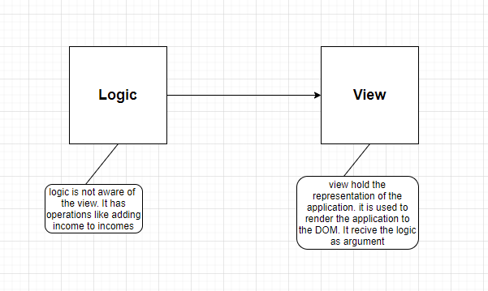
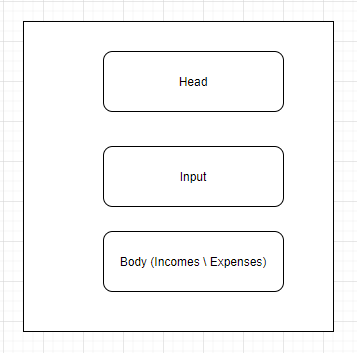

<h2>Motivation</h2>
Build the budget project (javascript project) in vanilla typescript. Check <a href='https://www.youtube.com/watch?v=z4cYVYMJs80&list=PLT6u32ApxFVBRo-wCMmwdp2c66GscEDy6&index=1'>here</a>

<h2>Top-level schema</h2>

<h3>logic \ view relation</h3>

<h3>app view modules</h3>

<h2>Highlights</h2>
<ul>
<li>practice with typescript based on the 10-90% course</li>
<li>use the power of es modules</li>
<li>separate the application to logic and view</li>
<li>use component-based design</li>
<li>build a great client-side application using vanilla typescript
</li>
<li>use flexbox and advanced javascript features like classList</li>
<li>use typescript's DOM interfaces like HTMLDivElement</li>
</ul>

<h2>Design</h2>
<ul>
<li>view directory for view, logic directory for logic
</li>
<li>no persistence in local storage - this may be an exercise</li>
<li>View
<ul>
<li>component-based , like in react</li>
<li>three main components : Head.ts , Input.ts , Body.ts(Incomes.ts \ Outcomes.ts)</li>
<li>each component has CSS : Head.css , Input.css , Body.css(Incomes.css \ Outcomes.css)</li>
<li>add\delete item in Input cause render of Head \ Body</li>
</ul>   
</li>
<li>Logic
<ul>
<li>IBudgetItem : description : string , amount : number , id : string</li>
<li>incomes\incomes : IBudgetItem [] , outcomes : IBudgetItem [] (percentage is computed thus not here)</li>
<li>operations : computeBudget, deleteBudgetItem,addBudgetItem,......
</ul>
 </li>
</ul>

<h2>Flow</h2>
Do logic and view together in this order: Head, Input, Body

<h2>Future</h2>
<ul>
<li>fix todo</li>
<li>income \ outcome of head and body can have big common stuff</li>
</ul>